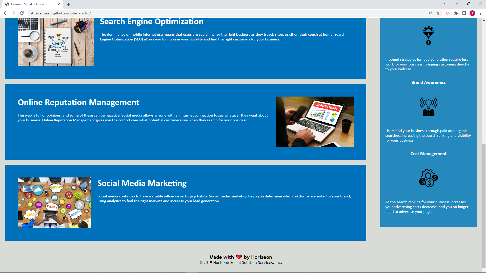

# code-refactor

## Description

The purpose of the project is to apply accessiblity standards to the HTML code so that is optimized for search engines.

I also put in alternative text description if images and icons did not load or load slowly.

The function of each part of the code can be more easily understood.  This applies for the HTML and how the CSS file interacts

Redundancies in the CSS code were removed.

I learned about how to alter code without changing the webpage.  I also learned how slightly changeing to code can dramtically alter the page.  

I saw how HTML and CSS interact with eachother.

## Installation

The webpage is a pamphlet with no moveing parts.  To run enter "https://allenvancil.github.io/code-refactor/" in to a search engine.
## Usage

The webpage should look like the following:

